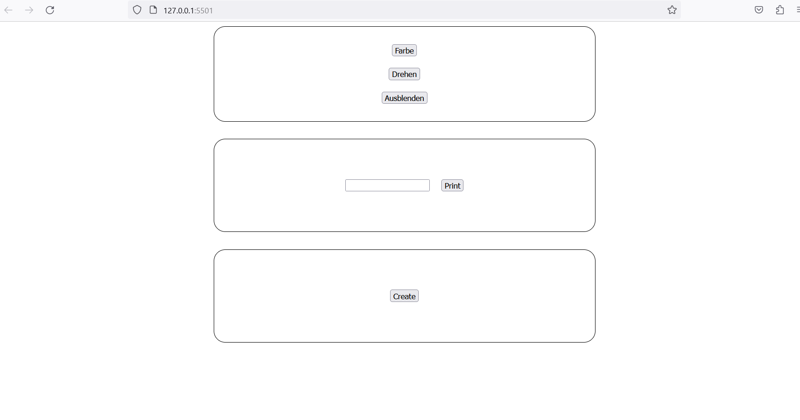

# JavaScript Exercise

**[Deutsch](README.md)** | English

## Preparation

- Create an **index.html**, **style.css**, and **script.js** file
- Create the basic HTML structure
- Link the style and script files in the HTML
- The HTML should contain 2 boxes (`
`) (the 3rd box is a bonus and can be omitted initially)
- The first box contains 3 buttons (`<button>`) with the following labels: **Color**, **Rotate**, **Hide**
- The second box contains an `<input>` field and a button (**Load Text**) (*don't use a form element here, just an input*)
- The third box is a bonus (see below): A box with a button (**Create**) and an empty `div` (not visible since it has no content)

***Here's a possible layout, but it doesn't matter if you match the design exactly - your buttons can also be arranged side by side:***

## Task
- Each `button` should get functionality:
  - `Color` → the first box should be colored
  - `Rotate` → the first box should rotate 360 degrees (use `transition` to see the effect)
  - `Hide` → clicking should make the box disappear
  - `Load Text` → the text from the input field should be displayed below

**Bonus** *(we didn't cover this in the presentation, try to google it or ask me :-)*
- `Create` → with each click, 5 new small boxes should be created in the box
- Try to assign a random color to the "Color" button with each click (this doesn't work with CSS classes, only with `element.style.backgroundColor`)