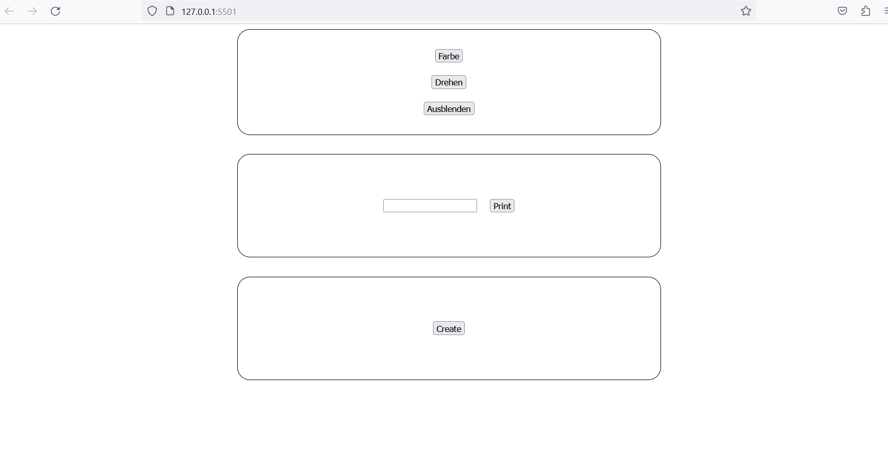

# JavaScript Exercise

🇩🇪 Deutsch | **[🇺🇸 English](README.en.md)**

### Vorbereitung

- Erstelle eine **index.html**, **style.css** und **script.js** Datei
- Erstelle die HTML-Grundstruktur
- Verlinke die Style- und Script-Datei in der HTML
- In der HTML sollten 2 Boxen (`
`) vorhanden sein (die 3. Box ist ein Bonus und kann am Anfang weggelassen werden)
- In der ersten Box befinden sich 3 Buttons (`<button>`) mit folgenden Bezeichnungen: **Farbe**, **Drehen**, **Ausblenden**  
- In der zweiten Box befindet sich ein `<input>`-Feld und ein Button (**Text laden**) (*verwende hier kein form-Element, sondern nur ein input*)
- Die dritte Box ist ein Bonus (siehe unten): Eine Box mit einem Button (**Erstelle**) und einer leeren `div` (nicht sichtbar, da kein Inhalt)

***Hier ist eine mögliche Darstellung, aber es kommt nicht darauf an, das Design genau zu treffen - eure Buttons können auch nebeneinander angeordnet sein:***

### Aufgabe
- Jeder `button` soll eine Funktionalität bekommen:
  - `Farbe` → die erste Box soll eingefärbt werden 
  - `Drehen` → der erste Kasten soll sich um 360 Grad drehen (benutze `transition`, um den Effekt zu sehen)
  - `Ausblenden` → beim Klicken soll der Kasten verschwinden
  - `Text laden` → der Text aus dem Eingabefeld soll darunter ausgegeben werden

**Bonus** *(hatten wir nicht in der Präsentation, versucht es zu googeln oder fragt mich :-)*
- `Erstelle` → bei jedem Klick sollen 5 neue kleine Boxen in der Box entstehen
- Versucht beim `button` "Farbe" eine zufällige Farbe mit jedem Klick zu vergeben (das geht nicht mit Klassen im CSS, nur mit `element.style.backgroundColor`)
